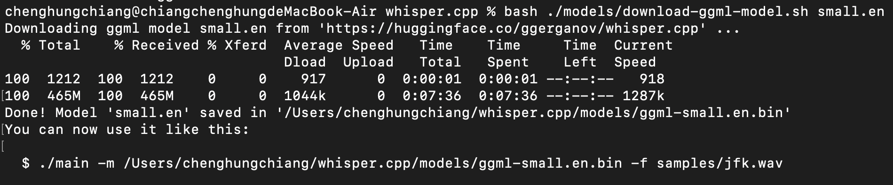
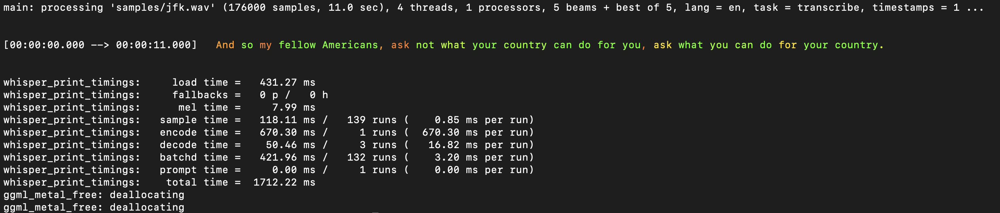

# LFX-Mentorship-2024-01-Pre-test

This is a repo of LFX Mentorship 2024-01 Pre-test for Integrate whisper.cpp as a new WASI-NN backend #3170

- Environment: macOS (M1)

- Author: Cheng-Hung Chiang

### Framework Execution: whisper.cpp

1. clone the repository
    ```
    git clone https://github.com/ggerganov/whisper.cpp.git
    ```
2. Download Whisper model: **small.en**
    ```
    bash ./models/download-ggml-model.sh small.en
    ```

    

3. Build the main example and transcribe an audio file
    ```
    make small.en

    ./main -m /Users/chenghungchiang/whisper.cpp/models/ggml-small.en.bin -f samples/jfk.wav
    ```

4. Performing real-time inference on audio from my microphone

    ```
    make stream

    ./stream -m ./models/ggml-small.en.bin -t 8 --step 500 --length 5000
    ```

    [](https://www.youtube.com/watch?v=M0AKrYx9F-w)

5. Confidence color-coding

    ```
    ./main -m models/ggml-small.en.bin -f samples/jfk.wav --print-colors
    ```

    

### Build the llama.cpp plugin:

1. Install WasmEdge
    ```
    curl -sSf https://raw.githubusercontent.com/WasmEdge/WasmEdge/master/utils/install.sh | bash -s -- --plugins wasmedge_rustls wasi_nn-ggml

    source /Users/chenghungchiang/.zshenv
    ```

2. Clone the repo and checkout to the specific branch
    ```
    git clone https://github.com/WasmEdge/WasmEdge.git
    git checkout hydai/0.13.5_ggml_lts
    cd WasmEdge
    ```

3. Install `cmake`, `ninja`, `llvm`, and export parameters.
    ```
    brew install cmake ninja llvm
    export LLVM_DIR="$(brew --prefix)/opt/llvm/lib/cmake"
    export CC=clang
    export CXX=clang++
    ```

4. Build WasmEdge with WASI-NN llama.cpp Backend
    ```
    cmake -GNinja -Bbuild -DCMAKE_BUILD_TYPE=Release \
    -DWASMEDGE_PLUGIN_WASI_NN_BACKEND="GGML" \
    -DWASMEDGE_PLUGIN_WASI_NN_GGML_LLAMA_METAL=ON \
    -DWASMEDGE_PLUGIN_WASI_NN_GGML_LLAMA_BLAS=OFF \
    .
    cmake --build build
    cmake --install build
    ```

5. Selected model: **OpenChat-3.5**
- Download the model
    ```
    curl -LO https://huggingface.co/second-state/OpenChat-3.5-GGUF/resolve/main/openchat_3.5-Q5_K_M.gguf
    ```
- Chat with the model on the CLI
    ```
    curl -LO https://github.com/second-state/LlamaEdge/releases/latest/download/llama-chat.wasm

    wasmedge --dir .:. --nn-preload default:GGML:AUTO:openchat_3.5-Q5_K_M.gguf llama-chat.wasm -p openchat -r '<|end_of_turn|>'
    ```

- [](https://www.youtube.com/watch?v=Hjm0Na2q0CA)

